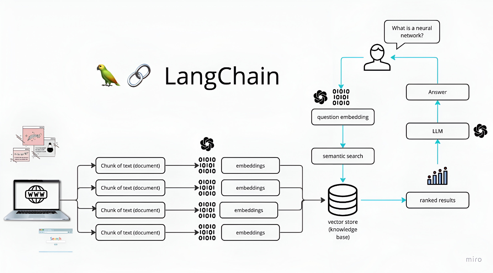

# AI-Powered Web Scraper and Chatbot

Welcome to AI-Powered Web Scraper and Chatbot, an advanced Python application designed to scrape web content and provide intelligent conversational capabilities. This project leverages Gemini Vision Pro, Selenium, custom logic, Langchain, and FAISS to extract, process, and interact with data from websites.

## Table of Contents

- [Introduction](#introduction)
- [How It Works](#how-it-works)
- [Dependencies and Installation](#dependencies-and-installation)
- [Usage](#usage)
- [Contributing](#contributing)
- [License](#license)

## Introduction

The AI-Powered Web Scraper and Chatbot is a versatile application that can scrape content from websites and provide interactive chat functionality. Here's how it works:

### Key Technologies:
- **Gemini Vision Pro:** Utilizes advanced computer vision techniques to identify and extract relevant content from images and other media types on web pages.
- **Selenium:** Automates browser interactions to navigate through web pages, simulate user actions, and scrape dynamic content.
- **Custom Logic:** Employs custom algorithms and heuristics to process the scraped data, ensuring accurate and contextually relevant information extraction.
- **Langchain:** Integrates natural language processing and vector storage technologies to enhance the chatbot's conversational capabilities.
- **FAISS:** Utilized for efficient vector storage and similarity search, enabling fast and accurate retrieval of relevant information.

Once the content is scraped, the application uses natural language processing and vector storage technologies to offer chatbot functionality, allowing users to interact with the extracted data through meaningful conversations.

## How It Works

The application follows these steps to provide responses to your questions:

1. **Data Loading:** The app reads data from various sources, including web content, and processes the content using Gemini Vision Pro, Selenium, and custom logic.
2. **Text Chunking:** The extracted text is divided into smaller chunks for efficient processing.
3. **Language Model:** The application uses Google Generative AI to generate vector representations (embeddings) of the text chunks.
4. **Vector Storage:** FAISS is used to store and manage these vector embeddings efficiently.
5. **Similarity Matching:** When you ask a question, the app compares it with the text chunks and identifies the most semantically similar ones using FAISS.
6. **Response Generation:** The selected chunks are passed to the language model, which generates a response based on the relevant content.



## Dependencies and Installation

To install the AI-Powered Web Scraper and Chatbot, please follow these steps:

1. Clone the repository to your local machine:

   ```bash
   git clone https://github.com/mxlik-ali/Ai-WebScraper.git
   cd AI-Powered-Web-Scraper-Chatbot
   ```

2. Start a virtual environment. Use the appropriate command based on your operating system:
   - **Windows:**
     ```bash
     python -m venv venv
     .\venv\Scripts\activate
     ```
   - **Linux:**
     ```bash
     python3 -m venv venv
     source venv/bin/activate
     ```

3. Install the required dependencies by running the following command:

   ```bash
   pip install -r requirements.txt
   ```

4. Obtain API keys from Google Generative AI and Google Gemini Vision Pro:
   - Sign up at [Google AI Studio](https://aistudio.google.com/) and obtain your API key.
   

5. Create a `.env` file in the project directory and add your API keys and the URL to scrape:

   ```plaintext
   GOOGLE_GENAI_API_KEY=your_generativeai_api_key
   GEMINI_VISION_API_KEY=your_gemini_vision_api_key
   URL=https://example.com
   ```

## Usage

To use the AI-Powered Web Scraper and Chatbot, follow these steps:

1. Ensure that you have installed the required dependencies and added the API keys and URL to the `.env` file.

2. Run the `main.py` file to scrape the website. Execute the following command:

   ```bash
   python main.py
   ```

3. After the scraping is complete, run the `app.py` file using the Streamlit CLI to start the chatbot application:

   ```bash
   streamlit run app.py
   ```

4. The application will launch in your default web browser, displaying the user interface.

5. Ask questions in natural language using the chat interface.

## Contributing

This repository is intended for educational purposes and does not accept further contributions. Feel free to utilize and enhance the app based on your own requirements.

## License

The AI-Powered Web Scraper and Chatbot is released under the MIT License.

